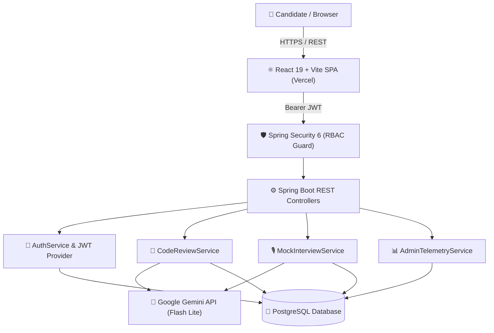

# ⚡ AlgoMock — AI-Powered Technical Interview & Code Review Platform

<div align="center">

  

  <br />

  <h3>Master Technical Interviews with Instant, Intelligent AI Mentorship</h3>

  <p align="center">
    An end-to-end technical interview preparation and code evaluation platform powered by <b>Google Gemini</b>, <b>Spring Boot</b>, and <b>React + Vite</b>.
  </p>

  <p align="center">
    <a href="https://algo-mock.vercel.app/"></a>
    <a href="https://github.com/niharika-1806/AlgoMock"></a>
    <a href="https://github.com/niharika-1806/AlgoMock/blob/main/LICENSE"></a>
  </p>

  <p align="center">
    
    
    
    
    
    
  </p>

</div>

---

## 🌐 Live Web Application

The frontend is live and deployed on Vercel:

👉 **[https://algo-mock.vercel.app/](https://algo-mock.vercel.app/)**

> **Note**: To use interactive AI code reviews and mock interview features with full persistence, ensure your local Spring Boot backend is running locally on port `8080`.

---

## 🌟 Key Features

### 🔍 1. Instant AI Code Review & Complexity Analysis
- **Static & Dynamic Analysis**: Evaluates submitted code for correctness, edge case vulnerabilities, and syntax issues.
- **Big-O Notation Detection**: Automatically computes Time Complexity and Space Complexity.
- **Actionable Optimization**: Provides line-by-line refactoring recommendations and a quality score out of 100%.

### 🎙️ 2. Interactive AI Mock Technical Interviews
- **Simulated Interview Environment**: Dynamic multi-topic interviews (Algorithms & Data Structures, System Design, Frontend, Backend).
- **Turn-by-Turn Evaluation**: AI interviewer asks adaptive follow-up questions, evaluates technical communication, and scores answers in real time.
- **Detailed Transcripts**: Full interview performance logs with strengths and actionable improvement tips.

### 📊 3. Candidate Analytics & Progress Tracking
- **Personalized Dashboard**: Visualizes daily practice streaks, total problems solved, average interview scores, and code quality progression.
- **Submission History**: Complete historical archive of past reviews and mock interview transcripts.

### 🛡️ 4. Exclusive Platform Administrator Control Center
- **Role-Based Access Control (RBAC)**: Strict JWT-enforced endpoint security separating standard candidates from administrators.
- **Platform Telemetry**: Real-time aggregate platform metrics including total registered candidates, global code reviews, overall average scores, and individual user drill-down history.

### 💎 5. Modern Aurora Light UI
- High-performance glassmorphism, floating ambient orbs, fluid micro-animations, and full responsive layout.

---

## 🏗️ System Architecture



---

## 🛠️ Technology Stack

| Layer | Technologies & Tools |
| :--- | :--- |
| **Frontend** | React 19, Vite, React Router 7, Lucide React, CSS3 Glassmorphism |
| **Backend** | Java 17+, Spring Boot 4, Spring Data JPA, Hibernate ORM, Maven |
| **Security** | Spring Security 6, Stateless JWT (JSON Web Tokens), BCrypt Password Hashing |
| **Database** | PostgreSQL with relational entity mapping & text column indexing |
| **AI / LLM** | Google Gemini API (`gemini-3.5-flash-lite`) |
| **Deployment** | Vercel (Frontend SPA) |

---

## 📂 Repository Structure

```text
AlgoMock/
├── frontend/                        # React + Vite Frontend
│   ├── public/                      # Static assets & favicon
│   ├── src/
│   │   ├── components/              # UI components (Navbar, Footer, Hero, LoginForm, etc.)
│   │   ├── Pages/                   # Landing, Dashboard, Review, Interview, Admin, Signup
│   │   ├── utils/                   # Configurable API client & interceptors
│   │   ├── App.jsx                  # Route definitions & ProtectedRoute guards
│   │   └── main.jsx                 # Vite application entrypoint
│   ├── vercel.json                  # Frontend SPA routing configuration
│   └── package.json                 # Frontend dependencies & scripts
│
├── backend/                         # Spring Boot Java Backend
│   ├── src/main/java/com/algomock/backend/
│   │   ├── config/                  # SecurityConfig, CorsConfig, AdminAccountInitializer
│   │   ├── controller/              # Auth, CodeReview, MockInterview, Admin controllers
│   │   ├── dto/                     # Request and Response Data Transfer Objects
│   │   ├── model/                   # JPA Entities (User, CodeReview, MockInterview, etc.)
│   │   ├── repository/              # Spring Data JPA interfaces
│   │   └── service/                 # Gemini AI integration, Auth, Telemetry business logic
│   ├── src/main/resources/
│   │   └── application.properties   # Database, JWT, and Gemini AI configuration
│   ├── pom.xml                      # Maven project dependencies
│   └── mvnw.cmd / mvnw              # Maven wrapper executables
│
├── package.json                     # Monorepo root scripts (concurrent dev runner)
├── vercel.json                      # Root Vercel deployment configuration
├── start.bat                        # One-click Windows launch script
└── README.md                        # Project documentation
```

---

## 🚀 How to Run Locally (For Developers & Contributors)

Follow these simple steps to set up and run the complete AlgoMock project on your local machine:

### 1. Prerequisites
Ensure you have the following installed on your machine:
- **Node.js** (v18.0 or higher) — [Download Node.js](https://nodejs.org/)
- **Java Development Kit (JDK)** (JDK 17 or higher) — [Download OpenJDK / Temurin](https://adoptium.net/)
- **PostgreSQL** (v14 or higher) — [Download PostgreSQL](https://www.postgresql.org/download/)
- **Google Gemini API Key** — [Get a Free Key from Google AI Studio](https://aistudio.google.com/)

---

### 2. Clone the Repository
```bash
git clone https://github.com/niharika-1806/AlgoMock.git
cd AlgoMock
```

---

### 3. Set Up PostgreSQL Database
Open your PostgreSQL terminal (`psql`) or pgAdmin and create the database:
```sql
CREATE DATABASE algomock_db;
```

---

### 4. Configure Backend Settings
Open [`backend/src/main/resources/application.properties`](backend/src/main/resources/application.properties) and configure your database credentials and Gemini API Key:

```properties
spring.datasource.url=jdbc:postgresql://127.0.0.1:5432/algomock_db
spring.datasource.username=postgres
spring.datasource.password=YOUR_POSTGRES_PASSWORD

app.jwt.secret=mysecretkeyformyalgomockapplication1234567890
app.gemini.api-key=YOUR_GEMINI_API_KEY
app.gemini.model=gemini-3.5-flash-lite
```

*(Alternatively, you can export `GEMINI_API_KEY` and `SPRING_DATASOURCE_PASSWORD` as system environment variables).*

---

### 5. Launch the Application

#### Option A: One-Command Runner (All Platforms)
Install root dependencies and start both Frontend and Backend concurrently:
```bash
npm install
npm run dev
```

#### Option B: Windows One-Click
Double-click **`start.bat`** in the project root.

---

### 6. Access the Application

Once launched, both services will be active:

| Service | URL | Description |
| :--- | :--- | :--- |
| **Frontend Web App** | **[http://localhost:5173](http://localhost:5173)** | React + Vite UI |
| **Backend REST API** | **[http://localhost:8080](http://localhost:8080)** | Spring Boot API endpoints |

---

## 🌐 Deploying Frontend on Vercel

If you fork or deploy your own copy of the frontend:
1. Connect your GitHub repository to [Vercel](https://vercel.com/).
2. Vercel automatically detects the included `vercel.json` configurations.
3. In **Settings → Environment Variables**, set `VITE_API_URL` to your backend URL (or `http://localhost:8080` for local API pairing).
4. Click **Deploy**.

---

## 🤝 Contributing

Contributions, issues, and feature requests are welcome!
Feel free to check the [issues page](https://github.com/niharika-1806/AlgoMock/issues).

1. Fork the Project
2. Create your Feature Branch (`git checkout -b feature/AmazingFeature`)
3. Commit your Changes (`git commit -m 'Add some AmazingFeature'`)
4. Push to the Branch (`git push origin feature/AmazingFeature`)
5. Open a Pull Request

---

## 📄 License

Distributed under the **MIT License**. See `LICENSE` for more information.

---

<div align="center">
  <sub>Built with ❤️ by <a href="https://github.com/niharika-1806">Niharika</a> and contributors.</sub>
</div>
