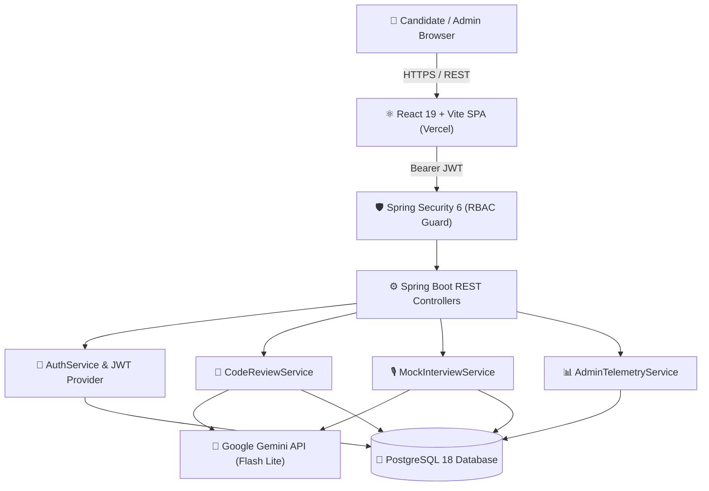

# ⚡ AlgoMock — AI-Powered Technical Interview & Code Review Platform

<div align="center">

  

  <br />

  <h3>Master Technical Interviews with Instant, Intelligent AI Mentorship</h3>

  <p align="center">
    An end-to-end technical interview preparation and code evaluation platform powered by <b>Google Gemini</b>, <b>Spring Boot</b>, and <b>React + Vite</b>.
  </p>

  <p align="center">
    <a href="https://algo-mock.vercel.app/"></a>
    <a href="https://github.com/niharika-1806/AlgoMock"></a>
    <a href="https://github.com/niharika-1806/AlgoMock/blob/main/LICENSE"></a>
  </p>

  <p align="center">
    
    
    
    
    
    
  </p>

</div>

---

## 🌟 Key Features

### 🔍 1. Instant AI Code Review & Complexity Analysis
- **Static & Dynamic Analysis**: Evaluates submitted code for correctness, syntax issues, runtime efficiency, and edge case vulnerabilities.
- **Big-O Notation Detection**: Automatically computes Time Complexity and Space Complexity.
- **Actionable Optimization**: Provides line-by-line refactoring recommendations and a comprehensive quality score out of 100%.

### 🎙️ 2. Interactive AI Mock Technical Interviews
- **Simulated Interview Environment**: Dynamic multi-topic interviews (Algorithms, System Design, Frontend, Backend).
- **Turn-by-Turn Evaluation**: AI interviewer asks follow-up questions, assesses communication clarity, and scores answers in real time.
- **Detailed Transcripts**: Access full interview feedback logs, strengths, and areas for improvement.

### 📊 3. Candidate Analytics & Progress Tracking
- **Personalized Dashboard**: Visualizes daily practice streaks, total problems solved, average interview scores, and code quality progression.
- **Submission History**: Complete historical archive of past reviews and interview transcripts.

### 🛡️ 4. Exclusive Platform Administrator Control Center
- **Role-Based Access Control (RBAC)**: Strict JWT-enforced endpoint security separating standard candidates from administrators.
- **Platform Telemetry**: Real-time aggregate platform metrics including total registered candidates, global code reviews, overall average scores, and individual user drill-down history.

### 💎 5. Modern Aurora Light UI
- Designed with high-performance glassmorphism, floating ambient orbs, fluid micro-animations, and full mobile-first responsiveness.

---

## 🏗️ System Architecture



---

## 🛠️ Technology Stack

| Layer | Technologies & Tools |
| :--- | :--- |
| **Frontend** | React 19, Vite, React Router 7, Lucide React, CSS3 Glassmorphism |
| **Backend** | Java 17+, Spring Boot 4, Spring Data JPA, Hibernate ORM, Maven |
| **Security** | Spring Security 6, Stateless JWT (JSON Web Tokens), BCrypt Password Hashing |
| **Database** | PostgreSQL 18 with relational entity mapping & text column indexing |
| **AI / LLM** | Google Gemini API (`gemini-3.5-flash-lite`) |
| **Deployment** | Vercel (Frontend SPA), Cloud-ready Backend (Render / Railway / Docker) |

---

## 📂 Repository Structure

```text
AlgoMock/
├── frontend/                        # React + Vite Frontend
│   ├── public/                      # Static assets & favicon
│   ├── src/
│   │   ├── components/              # Reusable UI components (Navbar, Footer, Hero, etc.)
│   │   ├── Pages/                   # Landing, Dashboard, Review, Interview, Admin, Auth
│   │   ├── utils/                   # Configurable API client & interceptors
│   │   ├── App.jsx                  # Route definitions & ProtectedRoute guards
│   │   └── main.jsx                 # Vite application entrypoint
│   ├── vercel.json                  # Frontend SPA routing configuration
│   └── package.json                 # Frontend dependencies & scripts
│
├── backend/                         # Spring Boot Java Backend
│   ├── src/main/java/com/algomock/backend/
│   │   ├── config/                  # SecurityConfig, CorsConfig, AdminAccountInitializer
│   │   ├── controller/              # Auth, CodeReview, MockInterview, Admin controllers
│   │   ├── dto/                     # Request and Response Data Transfer Objects
│   │   ├── model/                   # JPA Entities (User, CodeReview, MockInterview, etc.)
│   │   ├── repository/              # Spring Data JPA interfaces
│   │   └── service/                 # Gemini AI integration, Auth, Telemetry business logic
│   ├── src/main/resources/
│   │   └── application.properties   # Database, JWT, and Gemini AI configuration
│   ├── pom.xml                      # Maven project dependencies
│   └── mvnw.cmd / mvnw              # Maven wrapper executables
│
├── package.json                     # Monorepo root scripts (concurrent dev runner)
├── vercel.json                      # Root Vercel deployment configuration
├── start.bat                        # One-click Windows launch script
└── README.md                        # Project documentation
```

---

## 🚀 Quick Start Guide

### Prerequisites
- **Node.js** (v18.0 or higher) & **npm**
- **Java Development Kit (JDK)** 17 or higher
- **PostgreSQL** 14+ installed and running locally
- A **Google Gemini API Key** ([Get one from Google AI Studio](https://aistudio.google.com/))

---

### 1. Clone the Repository
```bash
git clone https://github.com/niharika-1806/AlgoMock.git
cd AlgoMock
```

### 2. Configure Environment Variables

#### Backend (`backend/src/main/resources/application.properties`)
Create or edit your application properties:
```properties
spring.datasource.url=jdbc:postgresql://127.0.0.1:5432/algomock_db
spring.datasource.username=postgres
spring.datasource.password=YOUR_POSTGRES_PASSWORD

app.jwt.secret=YOUR_64_CHARACTER_RANDOM_SECRET_KEY
app.gemini.api-key=YOUR_GEMINI_API_KEY
app.gemini.model=gemini-3.5-flash-lite
```

#### Frontend (`frontend/.env`)
```env
VITE_API_URL=http://localhost:8080
```

---

### 3. Run Locally (One-Command Startup)

Install root dependencies and launch both Frontend & Backend concurrently:
```bash
npm install
npm run dev
```

Or on Windows, simply double-click **`start.bat`**.

| Service | Local URL |
| :--- | :--- |
| **Frontend Web App** | [http://localhost:5173](http://localhost:5173) |
| **Backend REST API** | [http://localhost:8080](http://localhost:8080) |

---

## 🔑 Default Administrator Credentials

Upon initial database startup, a dedicated administrator account is seeded automatically:

| Field | Credentials |
| :--- | :--- |
| **Admin Portal URL** | `/admin` |
| **Email** | `niharika@algomock.com` |
| **Password** | `Admin@1806` |
| **Role** | `ADMIN` |

---

## 🌐 Deploying to Vercel

1. Push your repository to **GitHub**.
2. Go to [Vercel](https://vercel.com/) and click **Add New Project** → Import **`AlgoMock`**.
3. Under **Build & Development Settings**:
   - **Root Directory**: `.` *(auto-configured via `vercel.json`)* or set to `frontend`
   - **Build Command**: `cd frontend && npm install && npm run build`
   - **Output Directory**: `frontend/dist`
4. In **Environment Variables**, add:
   - `VITE_API_URL`: URL of your deployed Spring Boot backend.
5. Click **Deploy**!

---

## 🤝 Contributing

Contributions, issues, and feature requests are welcome!
Feel free to check the [issues page](https://github.com/niharika-1806/AlgoMock/issues).

1. Fork the Project
2. Create your Feature Branch (`git checkout -b feature/AmazingFeature`)
3. Commit your Changes (`git commit -m 'Add some AmazingFeature'`)
4. Push to the Branch (`git push origin feature/AmazingFeature`)
5. Open a Pull Request

---

## 📄 License

Distributed under the **MIT License**. See `LICENSE` for more information.

---

<div align="center">
  <sub>Built with ❤️ by <a href="https://github.com/niharika-1806">Niharika</a> and contributors.</sub>
</div>
